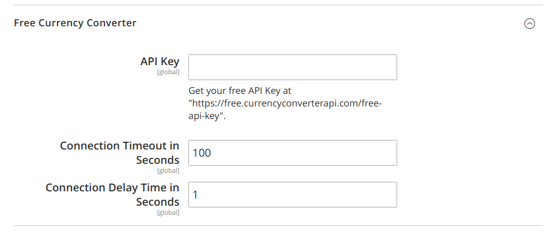

# mage2_ext_free_rates

Magento 2: Currency converter to get rates from https://free.currencyconverterapi.com/

[Based on "krybbio" code](https://magento.stackexchange.com/a/228671/33058). 

```
$ composer require flancer32/mage2_ext_free_rates
$ ./bin/magento setup:upgrade
$ ./bin/magento deploy:mode:set developer
$ ./bin/magento deploy:mode:set production
```


## Configuration

Get your free API Key at "https://free.currencyconverterapi.com/free-api-key" 
and put it into "_Stores / Configuration / General / Currency Setup / Free Currency Converter / API Key_":



## Uninstall

```
$ ./bin/magento module:disable Flancer32_FreeRates
$ composer remove flancer32/mage2_ext_free_rates
```
